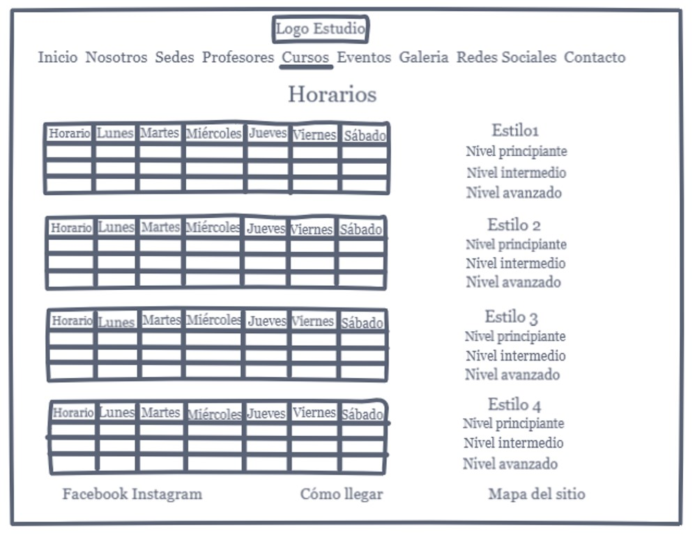

# Diseño de una página web para una academia, escuela o grupo de danza

## Introducción

Todo parte de la observación de que en Chile, la gran mayoría de academias, escuelas o estudios de danza no tienen página web. 

## Investigación

El objetivo principal fue entender la dinámica de comunicación, principalmente virtual, entre las academias, escuelas o grupos de danza y sus alumnos y/o apoderados, y la promoción a través de éstos medios virtuales. Para eso se realizaron 4 actividades diferentes:

1. Encuesta en línea.
2. Entrevistas a alumnos.
3. Revisión de páginas web de estudios de danza nacionales e internacionales.
4. Entrevistas a profesores.

Con la encuesta en línea se levantó información cuantitativa, mientras que con las 3 restantes se levantó información cualitativa.

## Síntesis de descubrimientos

### Cualitativos
La gran mayoría de las academias/escuelas/grupos de danza no tiene página web, pero sí redes sociales.
Prácticamente el 100% de los bailarines de academias/escuelas/grupos de danza, llega a través de la recomendación y el contacto persona a persona, e inmediatamente después, a través de Facebook.
La información se comparte principalmente por Whatsapp, Facebook, contacto directo entre profesores y alumnos, y un actor que está comenzando a entrar con mucha fuerza, Instagram, el cual está desplazando a YouTube como plataforma para subir videos.
A la gran mayoría de los usuarios les acomoda mucho Facebook, porque pueden compartir todos los tipos de contenidos, porque es muy masivo, porque pueden incluso compartir desde su propia cuenta etiquetando a la academia/estudio/grupo de danza, además pueden comentar y ver testimonios y opiniones de otras personas y una de las cosas que más destacan es el poder chatear e interactuar con los encargados de la academia/escuela/grupo de danza en tiempo real.
Les incomoda de Facebook que la información se pierde entre las publicaciones, el contenido desactualizado, el contenido basura entre el contenido relevante y que no se publica toda la información importante (horarios, valores, etc). Mientras el grupo de alumnos es pequeño, a los profesores les encanta contestar ellos mismos sus mensajes, pero cuando el grupo de trabajo llega a ser masivo, más de 100 alumnos, el sistema de mensajería se transforma en un gran problema que altera la calidad de vida de los profesores.
Para varios es un problema cuando no están conectados a internet de manera permanente, ya que se pierden de información relevante, y pasa que a veces, por ejemplo, se suspende o cambia un ensayo, y ellos llegan de todos modos. 
La mayoría opina que tener una página web que conecte todas las redes sociales sería bueno, ya que por costumbre, cuando uno busca algo en internet, lo hace a través de Google.Otras razones son: porque le facilita el acceso a todas las personas que no usan redes sociales, porque se espera que contenga toda la información de la academia/escuela/grupo de danza y porque se puede diseñar de manera personalizada, de acuerdo al estilo de la academia/escuela/grupo de danza.
A los usuarios no les gusta una página web, porque no tiene la opción de interactuar, ya sea a través de chat o comentarios en tiempo real.. Las academias/escuelas/grupos de danza tampoco las tienen porque dicen que es caro y difícil acceder a tener una, y porque no les permite saber lo que piensan los usuarios de ellos.
A los usuarios les gusta de Instagram que es menos personal, pero es casi igual de masivo que Facebook, que también se puede recibir comentarios de otros usuarios, que se puede publicar la información como fotos, que se puede usar un sistema de “etiquetados” con los Hashtag, que se pueden usar esas mismas etiquetas como medio de promoción, usando las palabras claves y eso permite rastrear la información de forma eficiente y sencilla, y filtrar, para que no aparezca información no deseada.
A los usuarios no les gusta de Instagram, que tiene un tiempo máximo de duración de los videos de 1 minuto, y los profesores consideran poco práctico tener tantas redes sociales que administrar por ellos mismos.
Las principales causas descritas para los problemas de comunicación con redes sociales, es que a las personas no les gusta leer, y que o no tienen, o no manejan bien las redes sociales.
Con respecto a las páginas web analizadas, en varios casos se encontró información incompleta. Los contenidos suelen estar bien organizados y es fácil intuir hacia dónde ir, excepto en la página de Salimpour School. Los diseño parecen estar más personalizados a nivel local, que en las páginas extranjeras revisadas, donde presentan, en general, un formato mucho más profesional que adaptado al estilo de la escuela.

### Cuantitativos

El 57.1% de los encuestados, llegó a su academia, escuela o grupo de danza por recomendación boca a boca. 
El 88.1% de los encuestados se comunica a través de whatsapp con su academia de danza.
El 95.2% de los encuestados, tiene un medio de comunicación web con su academia, escuela o grupo de danza.
El 85.3% de los encuestados busca información sobre los horarios, mientras que el 73.5% busca o sube videos o fotografías.
El 76.5% de los encuestados considera fácil encontrar la información que busca en los canales web de su estudio de danza, mientras que el 79.4% considera útil su canal web.
El 64.7% usaría para recomendar su estudio, academia o escuela de danza Facebook.
El 96.3% considera que una página web sería una buena opción para reunir toda la información, promocionar y comunicarse con su estudio de danza. 

Con todos éstos descubrimientos, creé 3 user persona con sus problemas y necesidades. Uno de ellos corresponde a una alumna de un estudio de danza, de 19 años, que hace poco comenzó la universidad y se siente muy complicada por el poco tiempo que tiene para poder seguir asistiendo a clases y estudiar, además de que no tiene internet móvil y le cuesta mantenerse conectada, mucho más le cuesta poder encontrar la información que necesita en el facebook del estudio de danza al que asiste. Un segundo arquetipo, corresponde a una profesora/directora de un estudio de danza. Ella se siente complicada al pasar muchas horas del día contestando whatsapp y msn, repitiendo la misma información que ya publicó, porque así le cuesta mucho tener vida personal y familiar. Además siente que ha perdido la oportunidad de tener más alumnos cuando su mensajería se ha visto sobrepasada por la cantidad de preguntas que debe responder 1 y 100 veces. El tercer usuario es un padre y apoderado de una pequeña, quién por primera vez se está haciendo cargo de su hija y sus talleres de danza, entre otros. No es muy amante de las redes sociales, y le da pereza tener que buscar la información dentro de Facebook. Es bastante despistado, por lo que a menudo se le olvida preguntarle a la profesora las novedades. Su peor temor es que su princesita se pierda una presentación porque él no se enteró o no llevó todo lo que la pequeña necesitaba.

 

## Ideación

Con todas las problemáticas analizadas, decidí diseñar una página web para un estudio de danza, que permita resolver algunas de las necesidades de los usuarios descritos. Uno de los requerimientos tanto de usuarios bailarines, como profesores, fue que el diseño fuera personalizado según su estilo de danza o acorde a la imagen de la escuela, por esta razón, al no tener un “cliente” real, decidí dejarla sin estilos, imágenes ni contenidos específicos. Es solo un esquema base de la información y el orden que ésta debería tener en un sitio web de una academia, escuela o grupo de danza. Si bien las academias de danza no suelen tener gran cantidad de información en sus páginas, para poder acotar el trabajo, me enfoqué en crear las vistas del inicio, la galería de fotografías, los horarios y los estilos de danza.  

Usando como base los contenidos de las páginas analizadas, otras que sólo revisé visualmente, y las respuestas de mis entrevistas y encuesta, elaboré una lista. Diseñé un card sorting abierto en Optimal Workshop para ver cómo los usuarios agrupaban los posibles contenidos y, las etiquetas que usaron con cada grupo, para usarlas eventualmente en el menú de la página de inicio.

Además, con esos resultados, y la observación de otras páginas web de estudios de danza, se diseñó un mapa del sitio, detallando los contenidos de la página de inicio. 

## Prototipado y testeo

Ya con las ideas más claras sobre la información de la página, me propuse hacer un sketch de las vistas señaladas en el apartado de ideación. El sketch lo realicé usando las herramientas de Invision. 

(https://projects.invisionapp.com/freehand/document/1uGAo0gsm
https://projects.invisionapp.com/freehand/document/vVqJeRyfE
https://projects.invisionapp.com/freehand/document/yHatjdGpH
https://projects.invisionapp.com/freehand/document/tLKVVeokm
https://projects.invisionapp.com/freehand/document/cCEcUPcJT
https://projects.invisionapp.com/freehand/document/OQfFObvtR
https://projects.invisionapp.com/freehand/document/5lErp5t1I
https://projects.invisionapp.com/freehand/document/2j4CrWm5E
https://projects.invisionapp.com/freehand/document/p7rCR4ssX
https://projects.invisionapp.com/freehand/document/blmocfjX9
)

Para ahorrar tiempo, usé esas mismas vistas y armé un prototipo en Marvel:

https://marvelapp.com/3ab7fhg

Uno de los grandes conflictos fue poder conseguir la ayuda de usuarios reales (bailarines, estudiantes de danza, gente interesada en bailar o regalar un curso de danza, profesores, padres y/o apoderados) que me permitieran tener un trabajo acotado a la realidad. Solo pude realizar 2 pruebas del prototipo. Si bien fueron muy pocas, lo ideal hubieran sido 5 al menos, los resultados fueron útiles para poder mejorar los diseños. 

Los objetivos a probar con los testeos fueron: 

1) Conocer si el diseño es fácilmente usable.
2) Saber si la información está bien clasificada dentro del menú.
3) Conocer el comportamiento del usuario al ingresar a la página.

Un primer usuario, estudiante de pedagogía en inglés, estaba interesado en regalar un curso de danza a su polola. Una de mis tareas definidas para probar éste diseño, consistía en obtener la información de los estilos de danza y horarios. Me comentó que para obtener la información que necesitaba (estilos, horarios, valores), hubiera ido de inmediato a la sección contacto, para obtener un número de teléfono, y conseguir mediante una llamada la información que le interesaba. En mi mapa del sitio no contaba con esa información, así que ahí encontré una primera oportunidad de mejora. 

Mi segunda usuaria, es una joven bailarina, que estudiaba para ser coreógrafa profesional, hasta que una lesión en los tobillos le impidió seguir adelante. Aún desea volver a bailar, pero todavía se siente muy complicada emocionalmente como para hacerlo pronto. Al realizar las tareas, ella encontró bastante útil tener la información de los estilos y horarios por separado. Le gustó la información de los distintos estilos, pero los horarios, que como vieron en el sketch estaban detallados para cada estilo de danza por separado, le parecieron poco prácticos. Para ella era mucho más práctico que aparecieran todos como en una malla curricular universitaria y ojalá con leyenda para cada curso o nivel dentro del horario propiamente tal. Además me comentó los contenidos que esperaba ver detrás de cada sección del menú. Lo cuál coincidió muy bien con lo que tenía definido en mi mapa del sitio, excepto nuevamente por la falta del número de teléfono. Además, me hizo notar la ausencia de la flecha atrás en el sketch.

Con éstos detalles revelados por el testeo, hice algunas mejoras que se pueden apreciar en el prototipo de Marvel, y en el mapa del sitio.

